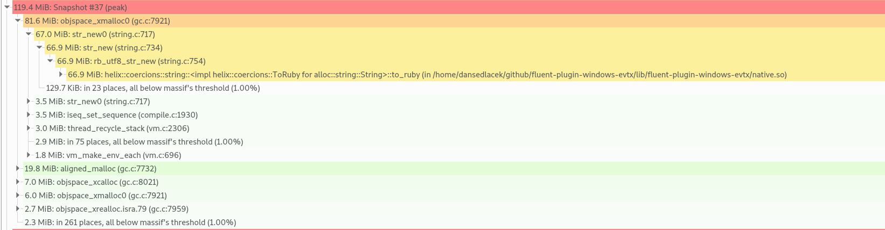

# fluent-plugin-windows-evtx

[Fluentd](https://fluentd.org/) **experimental** input plugin to do reads of
Windows EVTX files.

**DO NOT EXPECT THIS TO WORK**. This is the outcome of a weekend Hack-a-thon
with the intent of solving [this
issue](https://github.com/fluent/fluent-plugin-windows-eventlog/issues/15) in
the Windows EventLog fluentd plugin. Despite what it says I couldn't get the
workaround to work without flooding my test machine with events from the
Application log so it got me to ponder about what an implementation that only
read `evtx` files could look like instead of needing to do Win32 API calls.

In its current state, this can do little
more than read an entire `evtx` file and then emit all the events. I maybe spent
some time thinking about implementing position tracking or doing ranged reads of
the file, but alas I did not have time to get that far.

In this experiment I have leveraged the Rust crate
[evtx](https://github.com/omerbenamram/EVTX) and [Helix](https://usehelix.com/)
to construct a compiled extension to avoid having to implement Microsoft's
[BinXML protocol](https://docs.microsoft.com/en-us/openspecs/windows_protocols/ms-even6/7cdd0c95-2181-4794-a094-55c78b389358)
in pure Ruby. Ruby tends to overallocate memory, and in experiments the crate
and Helix glue code can handle loading, parsing, and spitting out the default
Security log with auditing turned on (i.e. **LOTS** of events) with minimal
allocations on the heap.

Ruby seems to spend most of its allocations creating the strings for all the log
events, which in this case was 65,189:

Given the short amount of time I spent on this I'm sure there are some easy
optimization wins I did not catch. It *is* much better than what I started with,
which had several hundreds of MB of allocations because I wasn't writing
performant Ruby :laughing:.

# References

A big thanks to the authors of these articles, blogs, and references. They
helped me get a grasp on a basic implementation in a short amount of time
:smile:.

* [evtx](https://github.com/omerbenamram/EVTX)
* [Helix](https://usehelix.com/)
* [Hunting Down Memory Issues In Ruby: A Definitive Guide](https://www.toptal.com/ruby/hunting-ruby-memory-issues)
* [Ruby Hacking Guide: Chapter 5: Garbage collection](https://ruby-hacking-guide.github.io/gc.html)
* [Fluentd: How to Write Input Plugin](https://docs.fluentd.org/plugin-development/api-plugin-input)
* [rvm](https://rvm.io/)
* [The Rust Standard Library](https://doc.rust-lang.org/std/index.html)
